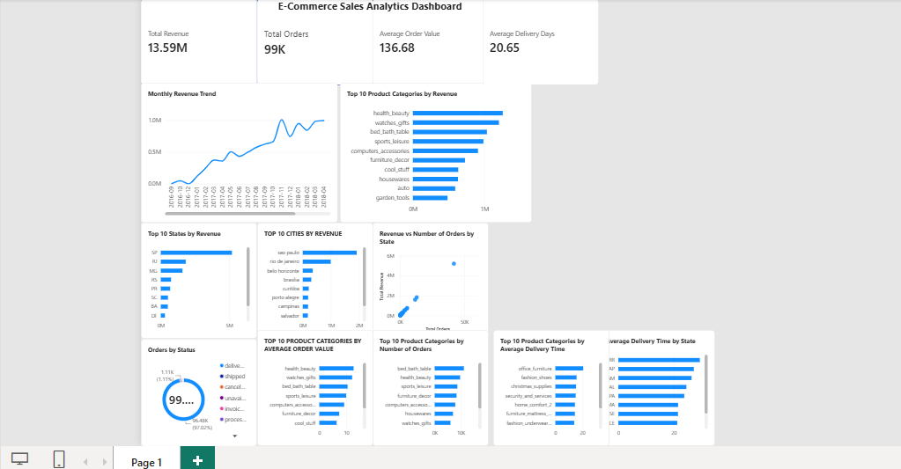

# E-Commerce Sales Analytics

This project analyzes an e-commerce dataset to better understand sales performance, customer behavior, product categories, and delivery performance.

I used PostgreSQL for the data analysis and Power BI to build a dashboard that brings the main results together in one place.

## Tools Used

- PostgreSQL
- SQL
- Power BI
- DAX

## Analysis

The analysis focuses on questions such as:

- How does revenue change over time?
- Which states and cities generate the most revenue?
- Which product categories generate the most revenue?
- Which product categories receive the highest number of orders?
- What is the average order value?
- How long does delivery take across different states and product categories?
- What is the relationship between the number of orders and revenue?

The SQL queries used for the analysis can be found in the `sql` folder.

## Dashboard

I created a Power BI dashboard to summarize the results and make it easier to explore the data.

The dashboard includes:

- Total Revenue
- Total Orders
- Average Order Value
- Average Delivery Time
- Monthly Revenue Trend
- Top Product Categories by Revenue
- Top States by Revenue
- Top Cities by Revenue
- Orders by Status
- Revenue vs. Number of Orders by State
- Average Order Value by Product Category
- Average Delivery Time by State
- Average Delivery Time by Product Category

## Key Insights

A few key findings from the analysis:

- The dataset contains approximately **99K orders** and generated around **13.59M in total revenue**.
- The overall **average order value is 136.68**.
- The average delivery time for delivered orders is approximately **20.65 days**.
- São Paulo is by far the largest market, generating more than **5M in revenue**.
- São Paulo city alone generated around **1.9M in revenue**, considerably more than any other city.
- Around **97% of orders were successfully delivered**, making `delivered` by far the most common order status.
- Health & Beauty is one of the strongest product categories, generating approximately **1.2M in revenue**.
- Some states have average delivery times close to **30 days**, showing noticeable regional differences in delivery performance.

## Project Files

- `sql/ecommerce_analysis.sql` – SQL queries used for the analysis
- `ecommerce_analysis.pbix` – Power BI dashboard
- `dashboard.png` – Screenshot of the final dashboard

## Dataset

This project uses the Brazilian E-Commerce Public Dataset by Olist.

The dataset contains information about customers, orders, order items, products, sellers, payments, and delivery dates. Multiple tables were combined to analyze sales performance from different perspectives.
